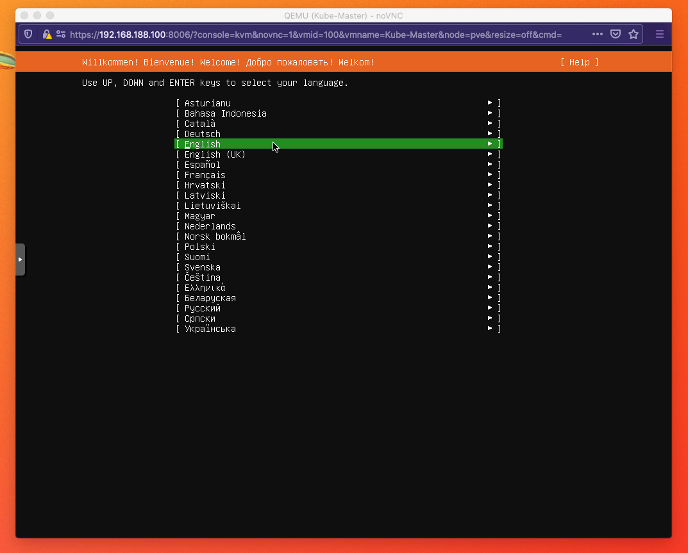
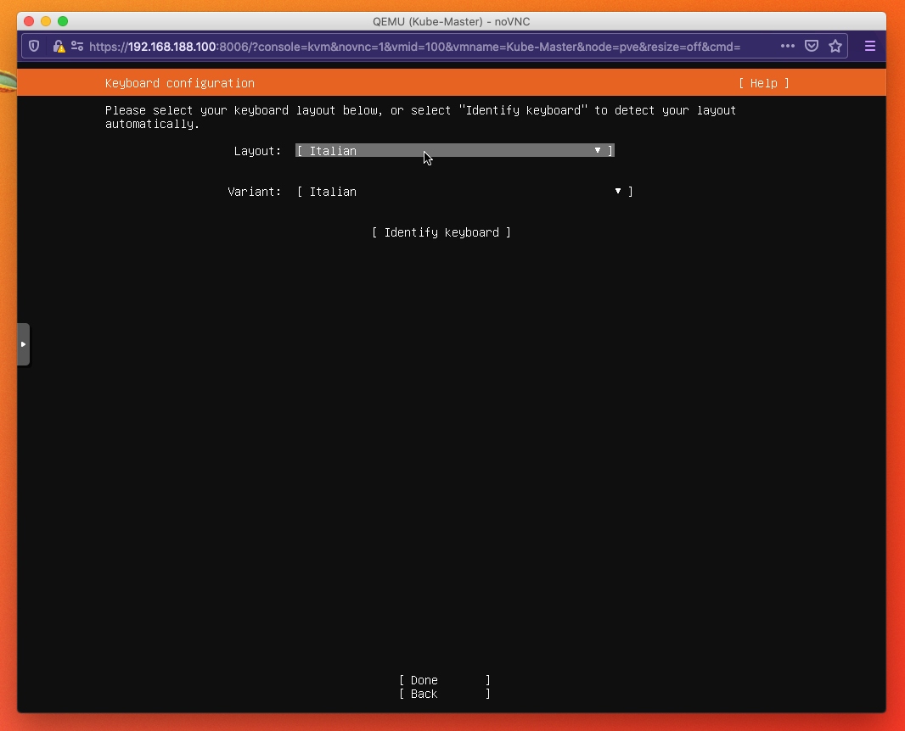
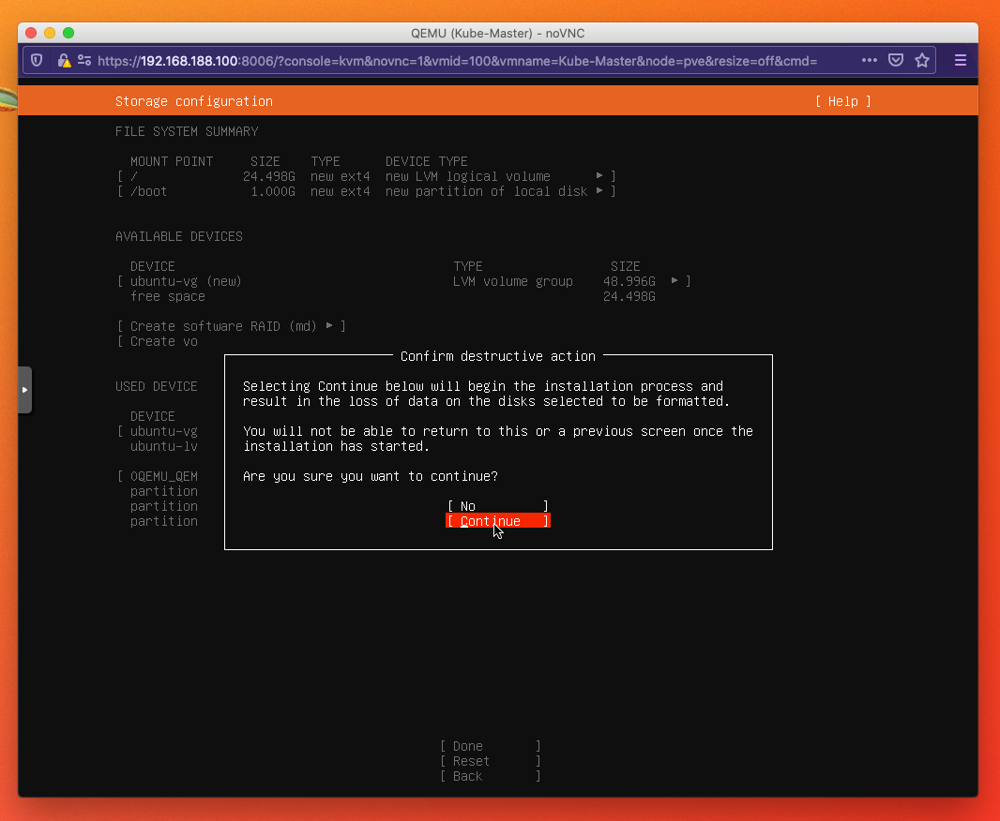
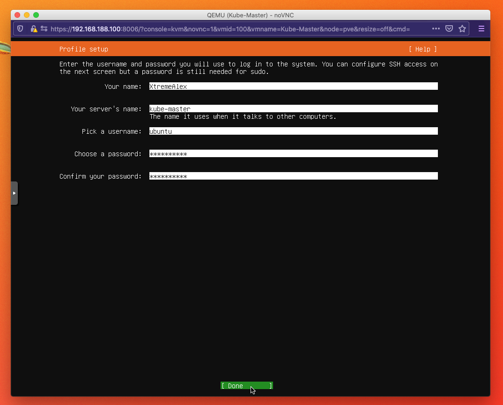
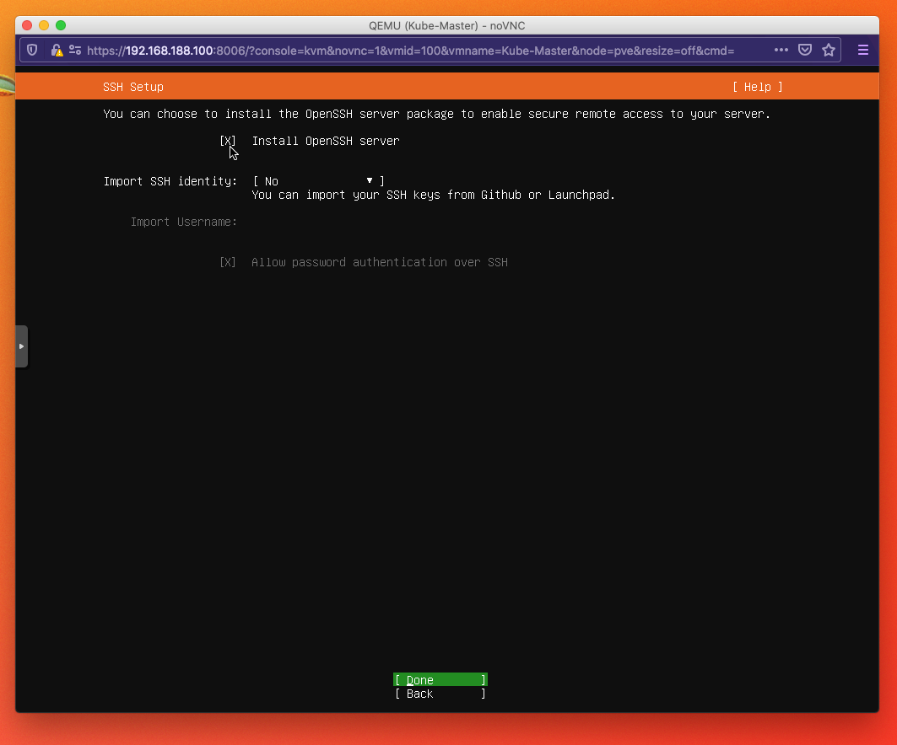
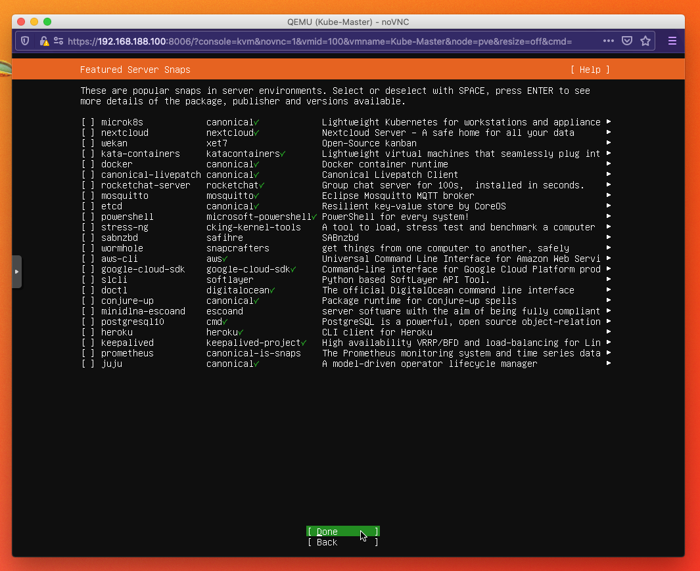
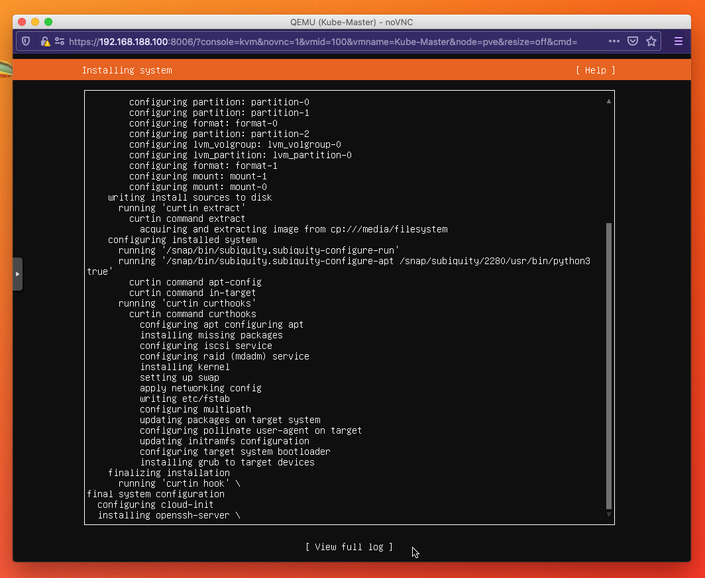

# Installare Ubuntu Server

Una guida per schermate all'installazione di Ubuntu Server. L'ho scritta
installando le VM del mio cluster Kubernetes su Proxmox, ma i passaggi sono gli
stessi su qualsiasi hypervisor o su una macchina fisica.

> La guida è stata scritta con Ubuntu Server 20.04.2 (2021). Con le versioni LTS
> più recenti l'installer è molto simile; se parti da zero, scarica l'ultima
> LTS da [ubuntu.com/download/server](https://ubuntu.com/download/server).

## Cosa ti serve

- L'ISO di Ubuntu Server usata nella guida:
  [ubuntu-20.04.2-live-server-amd64.iso](https://releases.ubuntu.com/20.04.2/ubuntu-20.04.2-live-server-amd64.iso)

## 1. Lingua: lascia l'inglese

## 2. Tastiera: scegli quella italiana

## 3. Vai avanti con `Done` fino a questa schermata, poi scegli `Continue`

## 4. Configura il server come nell'esempio

## 5. Abilita SSH

Proxmox ha già una console interattiva, ma per comodità per ora abilitiamo SSH.
Più avanti si può sempre disattivare.

## 6. Pacchetti aggiuntivi: non selezionare niente

Qui l'installer propone di installare in automatico alcuni strumenti. Può
tornare utile in casi particolari, ma per questa guida non serve nulla: premi
`Done`.

## 7. Aspetta che l'installazione finisca

## Prossimo passo

Se stai costruendo il cluster, torna alla
[guida Kubernetes](https://github.com/XtremeAlex/Kubernetes/tree/develop/_install_k8s).

## Autore

Andrei Alexandru Dabija — [github.com/XtremeAlex](https://github.com/XtremeAlex)
